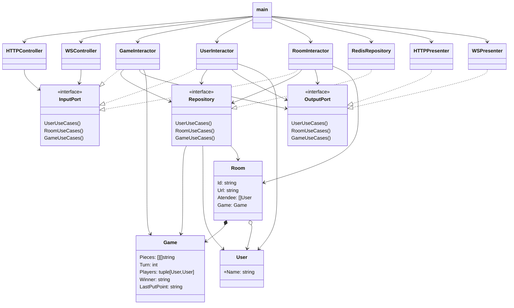

# クラス図

```mermaid
classDiagram

main --> HTTPController
main --> WSController
main --> GameInteractor
main --> UserInteractor
main --> RoomInteractor
main --> RedisRepository
main --> HTTPPresenter
main --> WSPresenter

HTTPController --> InputPort
WSController --> InputPort

GameInteractor ..|> InputPort
UserInteractor ..|> InputPort
RoomInteractor ..|> InputPort

GameInteractor --> Repository
UserInteractor --> Repository
RoomInteractor --> Repository

GameInteractor --> OutputPort
UserInteractor --> OutputPort
RoomInteractor --> OutputPort

GameInteractor --> Game
UserInteractor --> User
RoomInteractor --> Room

Repository --> Game
Repository --> User
Repository --> Room

HTTPPresenter ..|> OutputPort
WSPresenter ..|> OutputPort

RedisRepository ..|> Repository

Room *--> Game
Room o--> User

class User{
    +Name: string
}

class Room{
    Id: string
    Url: string
    Atendee: []User
    Game: Game
}

class Game{
    Pieces: [][]string
    Turn: int
    Players: tuple[User,User]
    Winner: string
    LastPutPoint: string
}

class Repository {
    <<interface>>
    UserUseCases()
    RoomUseCases()
    GameUseCases()
}

class InputPort{
    <<interface>>
    UserUseCases()
    RoomUseCases()
    GameUseCases()
}

class OutputPort{
    <<interface>>
    UserUseCases()
    RoomUseCases()
    GameUseCases()
}
```