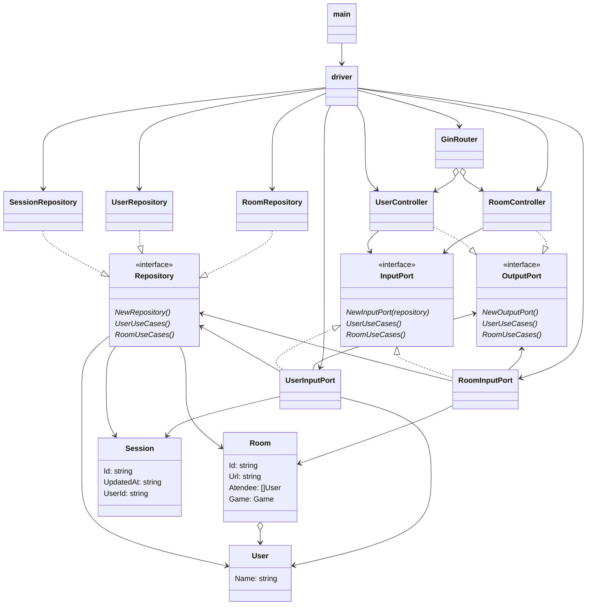

# クラス図

```mermaid
classDiagram

main --> driver

driver --> GinRouter

GinRouter o--> UserController
driver --> RoomController
GinRouter o--> RoomController
driver --> UserController
driver --> RoomInputPort
driver --> UserInputPort
driver --> UserRepository
driver --> RoomRepository
driver --> SessionRepository

RoomController --> InputPort
RoomController ..|> OutputPort

UserController --> InputPort
UserController ..|> OutputPort

RoomRepository ..|> Repository
UserRepository ..|> Repository
SessionRepository ..|> Repository

OutputPort <-- RoomInputPort 
InputPort <|.. RoomInputPort 
Repository <-- RoomInputPort 

OutputPort <-- UserInputPort 
InputPort <|.. UserInputPort 
Repository <-- UserInputPort 

RoomInputPort --> Room
UserInputPort --> User
UserInputPort --> Session

Room o--> User
Repository --> Room
Repository --> User
Repository --> Session


class Session{
    Id: string
    UpdatedAt: string
    UserId: string
}

class User{
    Name: string
}

class Room{
    Id: string
    Url: string
    Atendee: []User
    Game: Game
}

class Repository {
    <<interface>>
    NewRepository()*
    UserUseCases()*
    RoomUseCases()*
}

class InputPort{
    <<interface>>
    NewInputPort(repository)*
    UserUseCases()*
    RoomUseCases()*
}

class OutputPort{
    <<interface>>
    NewOutputPort()*
    UserUseCases()*
    RoomUseCases()*
}

```