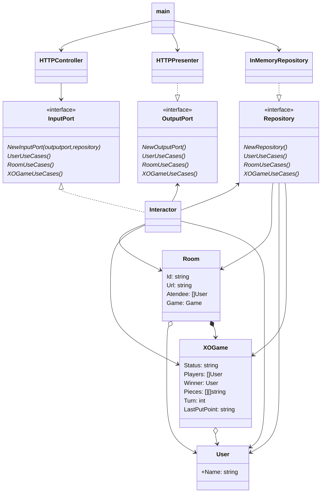

# クラス図

```mermaid
classDiagram

main --> HTTPController
main --> HTTPPresenter
main --> InMemoryRepository

HTTPController --> InputPort
HTTPPresenter ..|> OutputPort
InMemoryRepository ..|> Repository

OutputPort <-- Interactor  

InputPort <|.. Interactor

Repository <-- Interactor

Interactor --> Room
Interactor --> XOGame
Interactor --> User

Room o--> User
Room *--> XOGame
Repository --> Room
Repository --> User
Repository --> XOGame

XOGame o--> User

class User{
    +Name: string
}

class Room{
    Id: string
    Url: string
    Atendee: []User
    Game: Game
}

class XOGame{
    Status: string
    Players: []User
    Winner: User
    Pieces: [][]string
    Turn: int
    LastPutPoint: string
}

class Repository {
    <<interface>>
    NewRepository()*
    UserUseCases()*
    RoomUseCases()*
    XOGameUseCases()*
}

class InputPort{
    <<interface>>
    NewInputPort(outputport,repository)*
    UserUseCases()*
    RoomUseCases()*
    XOGameUseCases()*
}


class OutputPort{
    <<interface>>
    NewOutputPort()*
    UserUseCases()*
    RoomUseCases()*
    XOGameUseCases()*
}

```