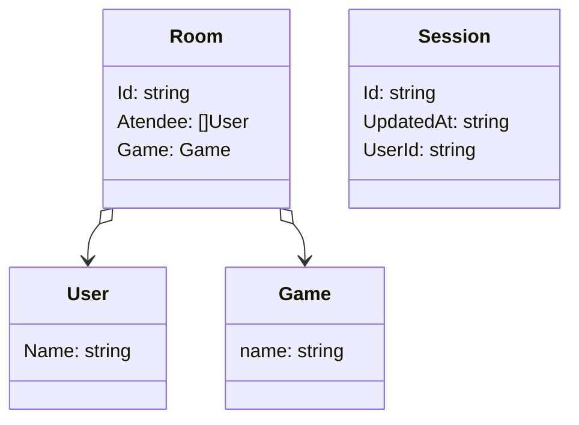

# クラス図

```mermaid
classDiagram
Room o--> User

class Session{
    Id: string
    UpdatedAt: string
    UserId: string
}

class User{
    Name: string
}

class Room{
    Id: string
    Atendee: []User
    Game: Game
}
Room o--> Game

class Game{
    name: string
}

```